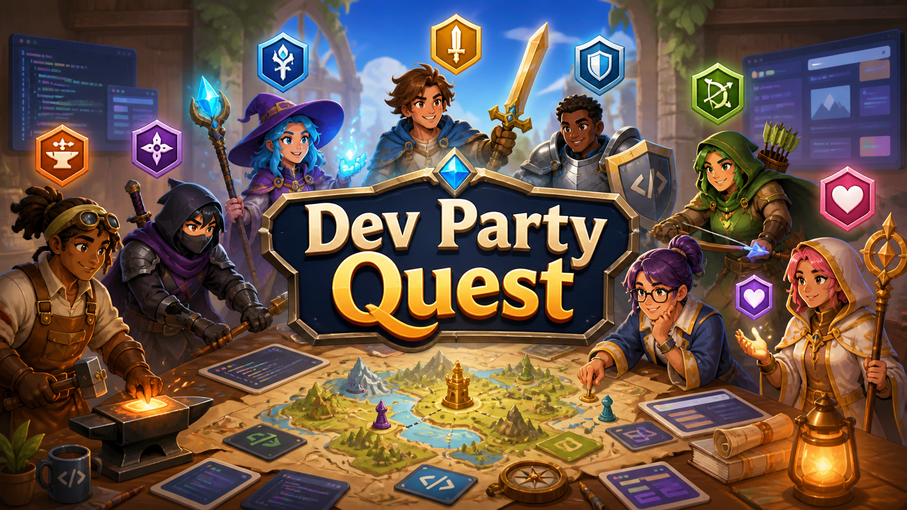

# Dev Party Quest

サービスURL: [https://devpartyquest.vercel.app/](https://devpartyquest.vercel.app/)

## 目次

- [サービス概要](#サービス概要)
- [開発背景](#開発背景)
- [サービスの利用イメージ](#サービスの利用イメージ)
- [サービスの差別化ポイント](#サービスの差別化ポイント)
- [機能紹介](#機能紹介)
- [診断タイプ](#診断タイプ)
- [技術スタック](#技術スタック)
- [技術選定の理由](#技術選定の理由)
- [ローカルでの起動方法](#ローカルでの起動方法)
- [プロジェクト構成](#プロジェクト構成)

## サービス概要

Dev Party Quest は、プログラミング学習者向けの RPG 風・開発チームロール診断アプリです。

8つの質問に答えると、自分が開発パーティーの中でどのような役割を担いやすいかを診断できます。結果は「プロダクト勇者」「UI魔法使い」「ロジック剣士」など、RPG の職業風に表示されます。

チーム開発にまだ慣れていない学習者でも、自分の強みや立ち回りをポジティブに捉え、イベントや学習コミュニティで会話のきっかけにできることを目指しています。

## 開発背景

プログラミング学習では、技術力だけでなく「チームの中で自分がどう動けるか」を知ることも重要です。

一方で、初学者にとってチーム開発の役割はイメージしづらく、「自分は何が得意なのか」「どんな場面で貢献できるのか」を言語化するのは簡単ではありません。

Dev Party Quest は、そうした自己理解を重くなりすぎない形で扱うために、RPG のパーティー診断という遊びやすい形式にしました。イベント中に短時間で診断でき、結果を見せ合うことで、参加者同士が自然に話し始められるミニアプリを目指しています。

## サービスの利用イメージ

1. トップページで「診断を始める」を押します
2. 開発スタイルに関する8つの質問に答えます
3. 回答ごとにスコアが加算され、最後に最も近いロールが決まります
4. 結果画面で、自分の強み・気をつけたいこと・チームでの立ち回りを確認します
5. 必要に応じて、診断結果を X で共有したり、もう一度診断できます

## サービスの差別化ポイント

一般的な性格診断や適職診断ではなく、プログラミング学習者のチーム開発に焦点を当てています。

| 観点 | Dev Party Quest の特徴 |
| --- | --- |
| テーマ | 開発チームを RPG のパーティーに見立てて、楽しく自己理解できる |
| 対象 | プログラミング学習者、チーム開発に興味がある人、イベント参加者に絞っている |
| 診断結果 | 強みだけでなく、チームでの立ち回りや相性の良いタイプも表示する |
| 使いやすさ | 8問だけで完了するため、イベント中でも気軽に遊べる |
| 共有性 | X 共有によって、診断結果をきっかけに交流しやすい |

## 機能紹介

### 実装済み機能

- トップページ表示
- 診断開始
- 8問の質問表示
- 回答選択
- 現在の質問数が分かる進捗表示
- 回答に基づくスコア計算
- 同点時の優先順位に基づく決定的な結果判定
- 診断結果の詳細表示
- もう一度診断する機能
- X 共有機能
- RPG 風のビジュアルスタイル

### 今後の改善候補

- 本番環境での最終動作確認
- 結果画面や共有文言のブラッシュアップ
- イベント利用時のフィードバックをもとにした質問文の調整
- スマートフォン表示での見やすさ改善

## 診断タイプ

| タイプ名 | RPG職業名 | 役割 |
| --- | --- | --- |
| プロダクト勇者 | 勇者 | ユーザー価値を考えて前に進める |
| UI魔法使い | 魔法使い | 見た目・体験づくりが得意 |
| ロジック剣士 | 剣士 | 処理や実装を着実に組む |
| バグハンター | 狩人 | エラーや違和感を見つける |
| 設計参謀 | 軍師 | 構造化・設計・整理が得意 |
| コミュ力僧侶 | 僧侶 | チームを支え、相談しやすい空気を作る |
| 爆速忍者 | 忍者 | とりあえず動かすスピード型 |
| 改善鍛冶師 | 鍛冶師 | リファクタ・磨き込みが得意 |

## 技術スタック

| 分類 | 使用技術 |
| --- | --- |
| フロントエンド | React 19 |
| 言語 | TypeScript |
| スタイリング | Tailwind CSS 4 |
| ビルドツール | Vite |
| テスト | Vitest |
| デプロイ | Vercel |

## 技術選定の理由

**React**  
質問カード、回答ボタン、進捗バー、結果カードのように、画面を小さなコンポーネントへ分けて扱いやすいため採用しました。診断中の画面状態も `start`、`question`、`result` のように段階で管理しやすく、MVP の実装に合っています。

**TypeScript**  
診断タイプ、質問、回答、結果、スコアを型で管理するために採用しました。特に診断タイプのキーやスコア計算は表示結果に直結するため、型で構造を固定することでデータのずれを防ぎやすくしています。

**Tailwind CSS**  
RPG 風の見た目を短いクラス指定で調整しやすく、コンポーネント単位でスタイルを確認しながら実装できるため採用しました。MVP では CSS 設計を大きくしすぎず、画面の雰囲気づくりに集中できます。

**Vite**  
React + TypeScript の開発環境を素早く立ち上げられ、ローカル開発と本番ビルドの確認がしやすいため採用しました。

**Vitest**  
Vite 構成と相性が良く、スコア計算や共有文言生成のようなロジックを軽量にテストできるため採用しました。

**Vercel**  
フロントエンドのみのアプリを簡単に公開でき、GitHub 連携によってデプロイ確認を進めやすいため採用しました。

## ローカルでの起動方法

```sh
npm install
npm run dev
```

本番用ビルドを確認する場合は、次のコマンドを実行します。

```sh
npm run build
npm run preview
```

テストを実行する場合は、次のコマンドを使います。

```sh
npm test
```

## プロジェクト構成

```txt
src/
  components/     # 画面を構成するUIコンポーネント
  data/           # 質問データ、診断結果データ
  types/          # 診断で使う共通型
  utils/          # スコア計算、共有文言生成などのロジック
  App.tsx         # 画面状態と診断フローの管理
  main.tsx        # Reactエントリーポイント
```

詳細な診断仕様、データ設計、実装Issueは `.codex/Plan.md` と `.codex/TODO.md` にまとめています。
